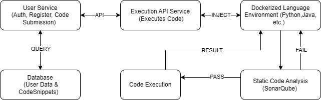

# Online Code Execution Platform

## Overview

This Online Code Execution Platform allows users to register, authenticate, submit, execute, and share code snippets in various programming languages. The platform is built using a microservices architecture with Java Spring Boot, Docker for containerized execution environments, and MySQL for relational data storage.

## System Design

## High-Level Design Overview

The **Online Code Execution Platform** is designed to allow users to register, submit, execute, and share their code snippets in various programming languages. The system operates under a microservices architecture that guarantees scalability, security, and flexibility. The platform uses Dockerized environments for each supported programming language to isolate the execution and ensure safe code execution. Furthermore, the platform employs static code analysis through SonarQube to ensure that the code being executed adheres to security and quality standards.

## System Architecture

The system is composed of multiple microservices that handle different aspects of the platform, including user authentication, code submission and execution, and code sharing.

### Key Components:

1. **User Service Microservice**:
    - Handles user registration, login, and authentication via JWT.
    - Manages user data and code submissions in a MySQL database.
    - Provides an API for email verification (future functionality).

2. **Execution API Service**:
    - Stateless service that handles the execution of code in isolated Dockerized environments.
    - Sends execution logs back to the user.
    - Designed for horizontal scalability to handle high concurrency.

3. **Dockerized Language Environments**:
    - Each supported programming language has its own Docker container.
    - Includes SonarQube for static code analysis to ensure the security and quality of the submitted code.

4. **MySQL Database**:
    - Stores user data, code snippets, and email verification tokens.
    - Data is structured into relational tables for efficient querying and management.

---

### Microservices Architecture

- **User Service Microservice**: Manages user registration, authentication (using JWT), and code submission.
- **Execution API Service**: Executes code in Dockerized environments and performs static code analysis using SonarQube.

## Class Diagram

### Classes:

1. **User**
    - Attributes:
        - `user_id`: Integer
        - `username`: String
        - `password_hash`: String
        - `email`: String
        - `is_enabled`: Boolean
    - Methods:
        - `registerUser()`
        - `authenticateUser()`


2. **CodeSnippet**
    - Attributes:
        - `code_id`: Integer
        - `user_id`: Integer (Foreign Key to User)
        - `language`: String
        - `code`: String
        - `result`: String
        - `timestamp`: DateTime
        - `shareable`: Boolean
    - Methods:
        - `submitCode()`
        - `getExecutionResult()`


3. **ExecutionRequest**
    - Attributes:
        - `request_id`: Integer
        - `user_id`: Integer (Foreign Key to User)
        - `language`: String
        - `code`: String
    - Methods:
        - `submitExecutionRequest()`
        - `fetchExecutionResult()`


4. **EmailVerification**
    - Attributes:
        - `verification_id`: Integer
        - `user_id`: Integer (Foreign Key to User)
        - `verification_token`: String
        - `verified_at`: DateTime
    - Methods:
        - `sendVerificationEmail()`
        - `verifyEmail()`

---

### Database Design

The system uses MySQL to manage relational data, with the following key tables:
- **Users**: Stores user authentication details.
- **CodeSnippets**: Stores user-submitted code snippets and execution results.
- **EmailVerification**: (Future) Stores email verification tokens.

## Database Schema

### Tables:

1. **Users Table**
    - `user_id`: INT (Primary Key, Auto Increment)
    - `username`: VARCHAR(255) (Unique)
    - `password_hash`: VARCHAR(255)
    - `email`: VARCHAR(255)
    - `is_enabled`: BOOLEAN (Determines if the user is allowed access after email verification)

2. **CodeSnippets Table**
    - `code_id`: INT (Primary Key, Auto Increment)
    - `user_id`: INT (Foreign Key to Users table)
    - `language`: VARCHAR(50)
    - `code`: TEXT
    - `result`: TEXT
    - `timestamp`: DATETIME
    - `shareable`: BOOLEAN (Flag to mark the code as shareable)

3. **EmailVerification Table** (Future)
    - `verification_id`: INT (Primary Key, Auto Increment)
    - `user_id`: INT (Foreign Key to Users table)
    - `verification_token`: VARCHAR(255)
    - `verified_at`: DATETIME (Timestamp when the email was verified)

---

### Key APIs

1. **POST /auth/register**: Register a new user and send an email verification link.
2. **POST /auth/login**: Authenticate a user and return a JWT token.
3. **GET /auth/verify-email**: (Future) Verify user's email using a token.
4. **POST /execute/code**: Submit code for execution.
5. **POST /code/{code_id}/share**: Mark a code snippet as shareable.
6. **POST /code/{code_id}/unshare**: Mark a code snippet as not shareable.
7. **GET /code/**: Retrieve a list of submitted code snippets.
8. **GET /code/{code_id}**: Retrieve a specific code snippet by `code_id`.

## High-Level Diagram



### Workflow:

1. **User Registration**:
    - User submits registration details (username, email, password) via the `/auth/register` API.
    - An email verification link is sent to the user.

2. **Email Verification** (Future):
    - User clicks the email verification link, and the `/auth/verify-email` endpoint verifies the user's email.

3. **User Login**:
    - User submits login details (username, password) via `/auth/login`.
    - JWT token is returned for subsequent authenticated requests.

4. **Code Submission and Execution**:
    - User submits a code snippet via `/execute/code` with the chosen programming language and JWT token.
    - The Execution API Service forwards the request to the appropriate Docker container.
    - Code is executed, and the result or error is returned to the user.

5. **Code Sharing**:
    - User marks a code snippet as shareable via `/code/{code_id}/share`.
    - The code is then available to others who access it with a valid link.

---

## Installation

Follow these steps to set up the Online Code Execution Platform on your local machine:

### Prerequisites

- Java Development Kit (JDK) 17
- Docker
- MySQL
- Maven

### Steps

1. **Clone the repository:**

   ```
   git clone https://github.com/your-username/online-code-execution-platform.git
   cd online-code-execution-platform
   ```

2. **Set up the MySQL database:**

   - Create a database named `code_execution_platform`.
   - Create a user with the necessary privileges and update the `application.properties` file in both microservices to include your MySQL credentials.

3. **Build the User Service Microservice:**

   ```
   cd user-service
   mvn clean install
   ```

4. **Build the Execution API Service:**

   ```
   cd execution-api
   mvn clean install
   ```

5. **Build and run Docker containers for code execution environments:**

   - Ensure you have Docker installed and configured on your machine.

6. **Run the microservices:**

   - Start the User Service Microservice:

     ```
     java -jar user-service/target/user-service.jar
     ```

   - Start the Execution API Service:

     ```
     java -jar execution-api/target/execution-api.jar
     ```

7. **Verify the setup:**

   - Use tools like Postman to interact with the APIs and ensure the system is functioning as expected.
   - Register a new user, log in to obtain a JWT token, and submit code for execution to test the full workflow.

## Future Enhancements

- Implement email verification during user registration.
- Support for additional programming languages and features.
- Advanced security measures and rate limiting.

## Summary

This system design for the **Online Code Execution Platform** ensures:

- **Scalability**: With a microservices architecture and stateless services like Execution API, the platform can scale to handle high traffic.
- **Security**: The use of JWT for authentication and SonarQube for static code analysis guarantees the security of both user data and code execution.
- **Flexibility**: The modular architecture allows for easy integration of additional languages, features, or security measures as the platform grows.
- **High Availability**: The Execution API Service is horizontally scalable and placed behind a load balancer to handle high concurrency efficiently.

### Project Proposal

You can download and view the full proposal PDF using the link below:

[Download Proposal PDF](assets/proposal.pdf)